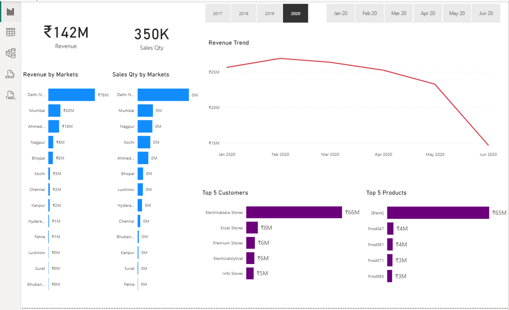
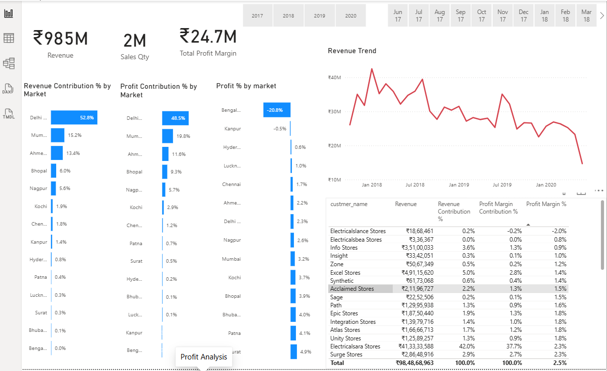
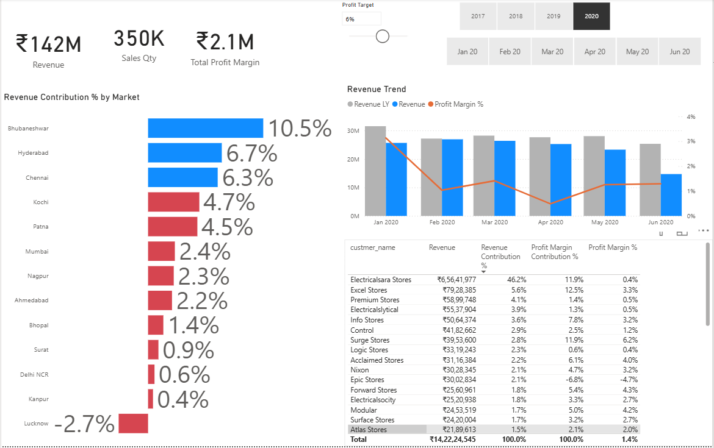

# 📊 Sales & Profitability Analytics Dashboard

### 🚀 Turning Business Data into Actionable Insights with Power BI

An interactive **Power BI Business Intelligence dashboard** designed to analyze **Sales, Revenue, Profitability, Market Performance, Customer Performance, and Product Performance** through intuitive visualizations and dynamic filters.

> 💡 **Project Goal:** Transform business data into clear, interactive insights that make sales and profitability performance easier to understand.

---

## 🎥 Dashboard Demo

Take a quick look at the interactive Power BI dashboard, including KPIs, revenue trends, profitability analysis, market performance, customer insights, and interactive filters.

### ▶️ [Watch the 60-Second Dashboard Demo](./Demo/Sales_Insights_Dashboard_Demo.mp4)

---

# 📊 Dashboard Preview

## 1️⃣ Sales Overview

A high-level view of sales performance with key business KPIs, revenue trends, market performance, top customers, and top products.



### 🔎 Key Analysis

- 💵 Revenue
- 📦 Sales Quantity
- 📈 Revenue Trends
- 🌍 Market-wise Performance
- 👥 Top Customers
- 🛍️ Top Products
- 📊 Profit Margin

---

## 2️⃣ Profit Analysis

A detailed view of profitability and revenue contribution across different markets and customers.



### 🔎 Key Analysis

- 💰 Profit Contribution
- 💵 Revenue Contribution
- 📊 Profit Margin %
- 🌍 Market-wise Profitability
- 📈 Revenue Trends
- 👥 Customer-level Profitability

---

## 3️⃣ Market & Customer Analysis

A deeper analysis of market contribution and customer-level performance.



### 🔎 Key Analysis

- 🌍 Market Contribution
- 📅 Monthly Revenue
- 💰 Monthly Profit
- 👥 Customer Revenue
- 📊 Customer Contribution
- 📈 Customer Profit Margin

---

# 🎯 Business Questions Answered

This dashboard helps answer important business questions such as:

- 🔹 How is overall revenue and sales performing?
- 🔹 Which markets contribute the most revenue?
- 🔹 Which markets generate the highest profit?
- 🔹 How does revenue change over time?
- 🔹 Which customers contribute the most revenue?
- 🔹 Which customers are most profitable?
- 🔹 Which products contribute significantly to sales?
- 🔹 How do profit margins vary across markets and customers?

---

# 💡 Key Insights

The dashboard enables analysis of:

### 📈 Sales & Revenue Trends
Track revenue and sales performance over time to identify growth patterns and periods requiring further investigation.

### 🌍 Market Performance
Compare different markets based on revenue, sales, profit, and contribution.

### 💰 Profitability
Analyze profit contribution and profit margins to understand differences between revenue generation and profitability.

### 👥 Customer Performance
Identify high-value customers and evaluate customer-level revenue and profitability.

### 🛍️ Product Performance
Analyze top-performing products and understand their contribution to overall sales.

### 📅 Time-Based Analysis
Use year and month filters to explore business performance across different time periods.

> **Note:** Dashboard results and insights can change depending on the selected filters.

---

# 🛠️ Tech Stack

| Technology | Purpose |
|---|---|
| 🟡 **Microsoft Power BI** | Dashboard development & visualization |
| 🔵 **Power Query** | Data cleaning & transformation |
| 🟣 **DAX** | Measures & business calculations |
| 🟢 **Data Modeling** | Relationships & analytical model |
| 📊 **Data Visualization** | Business reporting & insights |

---

# 🧠 Skills Demonstrated

### 📊 Data Analytics

- Data Cleaning
- Data Transformation
- Exploratory Data Analysis
- Sales Analysis
- Revenue Analysis
- Profitability Analysis
- Customer Analysis
- Market Analysis
- Trend Analysis

### 📈 Power BI

- Interactive Dashboard Development
- KPI Development
- DAX Measures
- Power Query
- Data Modeling
- Interactive Filters
- Business Visualizations
- Dashboard Design

### 💼 Business Intelligence

- Business KPI Analysis
- Performance Monitoring
- Market Performance Analysis
- Customer Performance Analysis
- Profitability Analysis
- Data-Driven Insights

---

# 📁 Repository Structure

```text
Sales-Profitabililty-Analytics-Dashboard-/
│
├── Dashboard/
│   └── Sales_Insights_Dashboard.pbix
│
├── Dashboard_Previews/
│   ├── Sales_Overview.png
│   ├── Profit_Analysis.png
│   └── Market_Customer_Analysis.png
│
├── Demo/
│   └── Sales_Insights_Dashboard_Demo.mp4
│
└── README.md
